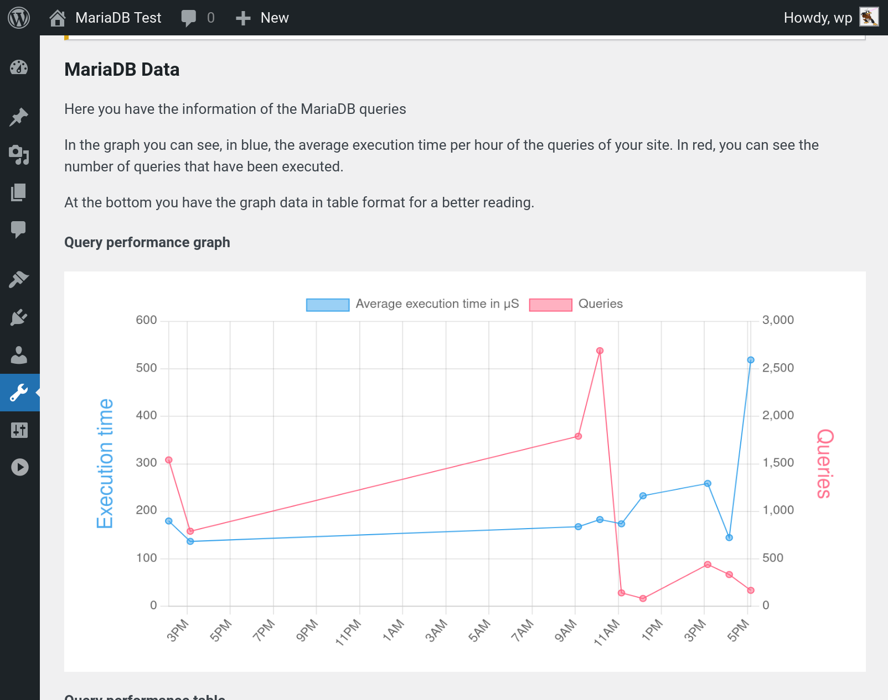
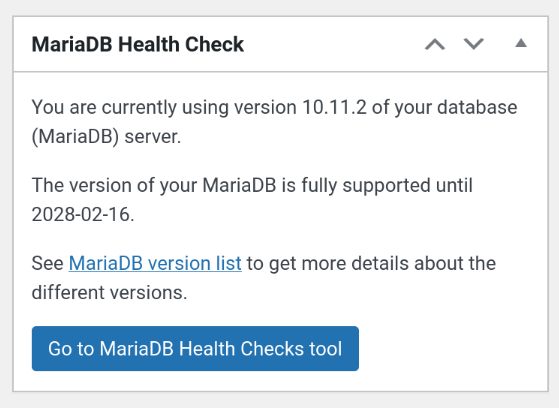

# MariaDB Health Checks

MariaDB Health Checks is a WordPress plugin that helps improve information about MariaDB on your server.

You will receive notifications related to the version of MariaDB that is installed, runtimes, histograms and warnings.

## Project information

This project was originally created at the 2023 CloudFest Hackathon.
It is designed to provide information and tools for your MariaDB server behind WordPress.

The first version provides information about the end of life status of your MariaDB Server, a graph of average access times for WordPress database queries, and the ability to build histograms for WordPress tables. In addition it adds a couple of checks to the Site Health plugin of WordPress.

